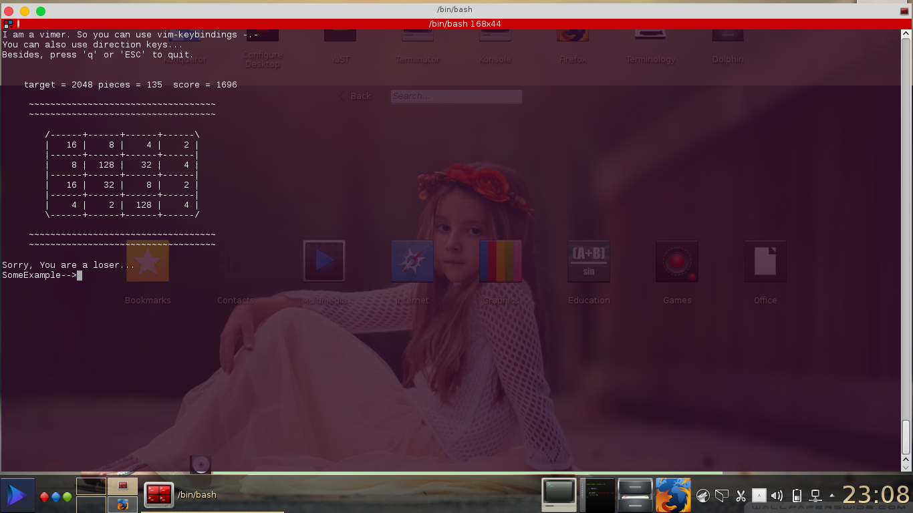
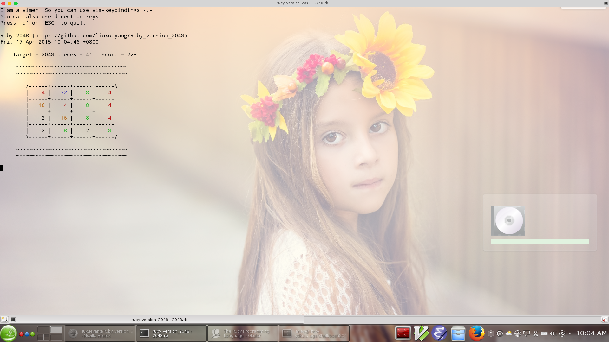

# Ruby_version_2048

##Ruby Implementation of 2048 game

###Version 1

* Played in terminal.
* Control with arrow keys or vim-keybindings.

This is what you will see:

###Version 2

* Add the color of numbers 
* Add time

This is what you will see:

